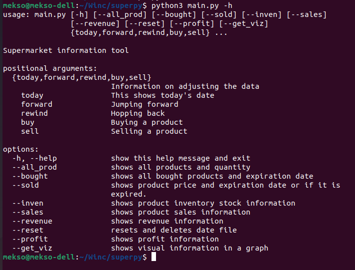

# Working with the Superpy information tool

## Index

- [Files](#files)
- [Command line interface](#command-line-interface)
- [Examples](#examples)

    - today
    - forward
    - rewind
    - buy
    - sell

- [First](#first)
- [Next](#next)
- [Finally](#finally)
    - [Commands](#commands)


---

### Files 

- sales.csv
- inventory.csv
- info_today.csv

_Looking in the file directory these files should be availabe._

###### [Page-Up](#index)


---
## Command Line Interface

Before we are going to start need we to understand that we are going to work from a **Command Line Interface (CLI).**
We need to keep in mind that we are working from existing files.
Using the programming language **Python**.

Next we want to make sure that we are in the correct directory meaning,
the **Winc** directory and then **superpy** .
If this is correct it should look like this.

``` python 
Computername: ~/Winc/superpy$
```


The ```info_today.csv``` gives us the information of today's date. This gives the user the ability to adjust the date inside the file. We can jump ```“forward”``` or we can move ```“rewind”``` backwards.
This tool also gives the user the ability to adjust the date to see if there are specified information on that date.

The usage of the tool helps the user get a more visual information on wich product are in stock(``inventory.csv``) and what the sales information is.(``sales.csv``).

With the tool we also can see other information like wich products have been sold and what has been bought. 
All product information and even profit and revenue and more.

Now we going to go over the commands inside the tool with examples.

###### [Page-Up](#index)

## Examples


Make sure that everytime we want to run a command we need to input:

```python
python3 main.py
```

and then the command.


## **First** 
We are going to start with the date manager:

### Today 

This command show us the date of today.
What is going to happen here is, when there is no file of the info_today.csv, it will create one and set the date of today(real time)

### Forward

This allows us to jump forward the x amount of days we want to, keep in mind the input we give is **(dd)**.

For example:
```python
python3 main.py forward --add 05 or 5
```
 

### Rewind

This essentially does the same thing as **forward** but then moving the date backwards.

for example:
```python
python3 main.py rewind --sub 05 or 5
```

keep in mind that when changing the date 
```python
--add or --sub
```

is required.

###### [Page-Up](#index)

## **Next**

### Buying 
Buying a product requires us to give more data input so the program knows what to do:

for example:
```python
python3 main.py buy --product cheese --price 4.5 --quantity 15 --expiration 2023-10-22
```

once you input this command you will notice a change in the inventory.csv file and can use it to sell it.

---
### Selling
This sells the product from the inventory.csv file and adjusts the quantity,
if by any chance the product runs out you will receive notification that the product is no longer in stock also if the product is not in stock at all you will also receive a notification about it.

for example:
```python
python3 main.py sell --product orange --quantity 10
```
###### [Page-Up](#index)

## **Finally**


With a small preview of what the program can do let's move to the help information

```python
python3 main.py -h 
```

With this command we can call the information on the superpy tool. This shows us the available commands with this tool so we can clearly see what they do and what information they give.

###### [Page-Up](#index)

---

### **Commands**

```python
python3 main.py --all_prod
```
This command shows us the inventory products and available quantity.

---

```python
python3 main.py --bought
```
This command show all the bought product and their expiration date.

---
```python
python3 main.py --sold
```
This command shows the product price and expiration date or i it was expired.

---
```python
python3 main.py --inven
```
This command shows the inventory stock information.

---
```python
python3 main.py --sales
```
This command shows the sales information.

---
```python
python3 main.py --revenue
```
This command shows the revenue information.

---
```python
python3 main.py --reset
```
This command resets and deletes the date file (```info_today.csv```)

---
```python
python3 main.py --profit
```
This command shows the profit information.

---
```python
python3 main.py -get_viz
```
This command shows the vizual information in a graph.

---

Below is a preview image of what the help information looks like.




###### [Page-Up](#index)