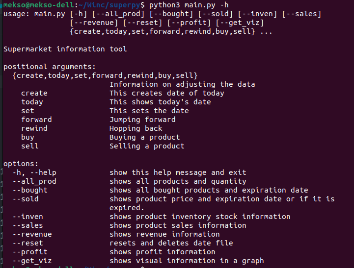

# Working with the Superpy information tool

## Contents

- [Requirements](#requirements)

    - [Check](#check)

- [Files](#files)
- [Command line interface](#command-line-interface)
- [Examples](#examples)

    - create
    - today
    - set
    - forward
    - rewind
    - buy
    - sell

- [First](#first)
- [Next](#next)
- [Finally](#finally)
    - [Commands](#commands)

---

### Requirements
Before we start we need to make sure we have the latest version of python installed.
Ideally Python 3 or higher.

In the directory there is a file called:

        requirements.txt

As we need a couple of modules in this project, you can ```pip install``` the information in that file.

Use:

        pip install -r requirements.txt

To install everything needed.

---

If you want to use a virtual enviroment ```(venv)``` for this project then do the following.

        python3 -m venv (your venv_name)
Example:

        python3 -m venv superpy
This will create a virtual environment, to acces the ```venv``` input the following:

##### On Windows

        venv_name\Scripts\activate

##### On Mac/Linux
        source venv_name/bin/activate

You can regocnize when you are in the ```venv``` with the following example

        (your_venv_name) yourcomputername:~/Winc/superpy$ 
**Follow the previous steps to install everything needed the for the project.**

###### ***With this it allows you to use the project with only the necessary packages.***

---
#### To exit the ```venv```

**Input:**

        deactivate

---

### Check
Use the:

        python3 -m pip check
To make sure you have everything needed.

After the install and everything is checked this should come out in your terminal:

        No broken requirements found.
        
###### [Page-Up](#contents)
---
## Files 

- sales.csv
- inventory.csv
- info_today.csv

_Looking in the file directory these files should be availabe._

###### [Page-Up](#contents)


---
## Command Line Interface

Before we are going to start need we to understand that we are going to work from a **Command Line Interface (CLI).**
We need to keep in mind that we are working from existing files.
Using the programming language **Python**.

Next we want to make sure that we are in the correct directory meaning,
the **Winc** directory and then **superpy** .
If this is correct it should look like this.

``` python 
Computername: ~/Winc/superpy$
```


The ```info_today.csv``` gives us the information of today's date. This gives the user the ability to adjust the date inside the file. We can jump ```“forward”``` or we can move ```“rewind”``` backwards.
This tool also gives the user the ability to adjust the date to see if there are specified information on that date.

The usage of the tool helps the user get a more visual information on wich product are in stock(``inventory.csv``) and what the sales information is.(``sales.csv``).

With the tool we also can see other information like wich products have been sold and what has been bought. 
All product information and even profit and revenue and more.

Now we going to go over the commands inside the tool with examples.

###### [Page-Up](#contents)

## Examples


Make sure that everytime we want to run a command we need to input:

```python
python3 main.py
```

and then the command.


## **First** 
We are going to start with the date manager:

### Create
This command creates the the ``info_today.csv`` if it already exists then it return the current date.

```python
python3 main.py create
```

### Today 

This command show us the date of today.
Basicly it reads the ``info_today.csv`` file.
If the file does not exist, it returns an error.

```python
python3 main.py today
```

### Set

This command makes sure you can set a date with following format
YYYY-MM-DD. With this you can move forwards or backwards.
For example:
```python
python3 main.py set --date 2023-10-25
```

### Forward

This allows us to jump forward the x amount of **DAYS** we want to, keep in mind the input we give is **(dd)**.

For example:
```python
python3 main.py forward --add 05 or 5
```
 

### Rewind

This essentially does the same thing as **FORWARD** but then moving the date backwards.

for example:
```python
python3 main.py rewind --sub 05 or 5
```

keep in mind that when changing the date by **DAYS**,
```python
--add or --sub
```

is required.

###### [Page-Up](#contents)

## **Next**

### Buying 
Buying a product requires us to give more data input so the program knows what to do:

for example:
```python
python3 main.py buy --product cheese --price 4.5 --quantity 15 --expiration 2023-10-22
```

Once you input this command you will notice a change in the ``inventory.csv`` file and can use it to sell it.

---
### Selling
This sells the product from the ``inventory.csv`` file and adjusts the quantity,
if by any chance the product runs out you will receive notification that the product is no longer in stock also if the product is not in stock at all you will also receive a notification about it.
This also puts information given ,to ``sales.csv`` file

for example:
```python
python3 main.py sell --product orange --quantity 10
```
###### [Page-Up](#contents)

## **Finally**


With a small preview of what the program can do let's move to the help information

```python
python3 main.py -h 
```

With this command we can call the information on the superpy tool. This shows us the available commands with this tool so we can clearly see what they do and what information they give.

###### [Page-Up](#contents)

---

### **Commands**

```python
python3 main.py --all_prod
```
This command shows us the inventory products and available quantity.

---

```python
python3 main.py --bought
```
This command show all the bought product and their expiration date.

---
```python
python3 main.py --sold
```
This command shows the product price and expiration date or i it was expired.

---
```python
python3 main.py --inven
```
This command shows the inventory stock information.

---
```python
python3 main.py --sales
```
This command shows the sales information.

---
```python
python3 main.py --revenue
```
This command shows the revenue information.

---
```python
python3 main.py --reset
```
This command resets and deletes the date file (```info_today.csv```)

---
```python
python3 main.py --profit
```
This command shows the profit information.

---
```python
python3 main.py -get_viz
```
This command shows the vizual information in a graph.

---

Below is a preview image of what the help information looks like.




###### [Page-Up](#contents)